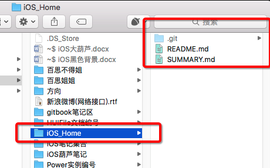

[参考网址：gitbook入门](http://www.jianshu.com/p/fa38ef97431d#)

	我最近接触到gitbook，发现它支持markdown和git，刚好把我之前在github上的笔记可以生成一本书，于是我就开始着手捣鼓gitbook，一下午的时间就弄的差不多了，说明这个东西还是挺容易的，可以看看我的书：
	
	建议直接在github上部署你的框架，然后再导入gitbook。

## 1. 在github上创建一个新的仓库（顺便创建README.md）
- [github网址](https://github.com)

## 2. 在github上创建一个新文件，名为SUMMARY.md

- [github网址](https://github.com)

- 在SUMMARY.md文件，里面填入：

		# Summary
		* [前言](README.md)
		

## 3. 本地创建目录，cd 进入此目录

	macdeiMac:iOS区 hui$ cd /Users/hui/Documents/FangCloudSync/亿方/iOS区 
## 4. clone 代码仓库

	macdeiMac:iOS区 hui$ git clone https://github.com/XiGuaPig/iOS_Home.git
	Cloning into 'iOS_Home'...
	remote: Counting objects: 6, done.
	remote: Compressing objects: 100% (3/3), done.
	remote: Total 6 (delta 0), reused 0 (delta 0), pack-reused 0
	Unpacking objects: 100% (6/6), done.
	Checking connectivity... done.

- 如果不使用HTTPS，后面同步书籍时，可能出现如下错误：（本结论未确认，下面这个截图是用oschina时出现的，并非GitHub）

- clone完毕之后

## 5. 使用GitBookEditor
1. **Import**

	
	
	
2. gitbook结构

	

3. 添加章节 - 直接填入中文名，会出现一点小BUG

	
	

6. 有一个小问题，没有解决，有点不方便，无法指定书籍路径：
	- 虽然我是cd 进入我创建的目录：

			macdeiMac:iOS区 hui$ cd /Users/hui/Documents/FangCloudSync/亿方/iOS区 
		
	- 但当我执行Import操作后，GitBookEditor生成的书籍总是跑到系统默认的那个目录中了：
	- 打开文件目录：
	
		
		
	- 目前，我还不知道用什么办法，来修改生成的书籍路径。
	
7. GitHub容量限制：

	**单个 Repository 不超过1G，单个文件不超过100M**