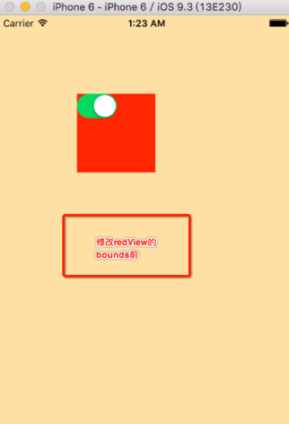
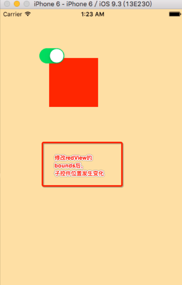

# 例1: bounds frame
【实例编号：Power:201702080129】未命名

- 修改redView的bounds前：

- 修改redView的bounds后，内部的子控件位置发生变化：

- 代码如下：

		//
		//  ViewController.m
		//  bounds_frame
		//
		//  Created by hui on 17/2/2.
		//  Copyright © 2017年 hui. All rights reserved.
		//
		
		/**
		 *  bounds 以自身的【左上角】作为坐标原点
		 */
		#import "ViewController.h"
		
		@interface ViewController ()
		@property (nonatomic,weak) UIView *redView;
		@end
		
		@implementation ViewController
		
		- (void)viewDidLoad {
		    [super viewDidLoad];
		    
		    UIView *redView = [[UIView alloc] init];
		    redView.backgroundColor = [UIColor redColor];
		    redView.frame = CGRectMake(100, 100, 100, 100);
		    [self.view addSubview:redView];
		    self.redView = redView;
		    
		    UISwitch *sw = [[UISwitch alloc] init];
		    sw.on = YES;
		    [self.redView addSubview:sw];
		}
		
		- (void)touchesBegan:(NSSet<UITouch *> *)touches withEvent:(UIEvent *)event {
		    
		    // 修改bounds值 - 对自身不影响，但会影响其内部子控件位置
		    CGRect bounds = self.redView.bounds;
		    bounds.origin = CGPointMake(20, 20);
		    self.redView.bounds = bounds;
		}
		@end

