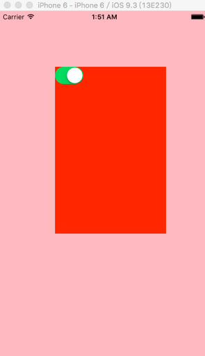
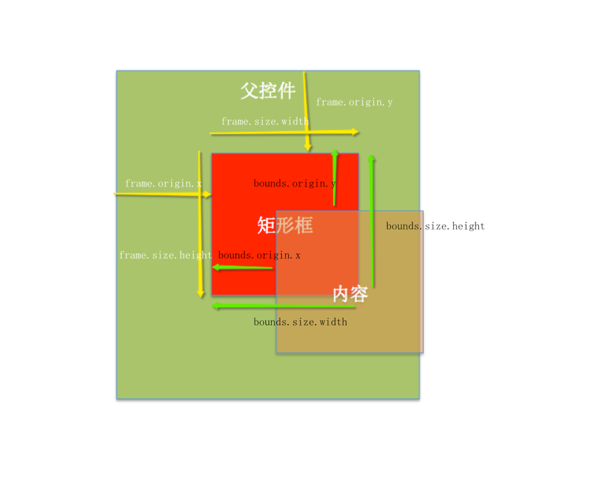

# 例2: bounds frame contentOffset
【实例编号：201702080130】未命名

- 代码如下：
		//
		//  ViewController.m
		//  bounds_frame02
		//
		//  Created by hui on 17/2/5.
		//  Copyright © 2017年 hui. All rights reserved.
		//
		
		#import "ViewController.h"
		
		@interface ViewController () <UIScrollViewDelegate>
		
		@property (nonatomic,weak) UIScrollView *scrollView;
		
		@end
		
		@implementation ViewController
		
		- (void)viewDidLoad {
		    [super viewDidLoad];
		    
		    UIScrollView *scrollView = [[UIScrollView alloc] init];
		    scrollView.backgroundColor = [UIColor redColor];
		    scrollView.frame = CGRectMake(100, 100, 200, 300);
		    scrollView.contentSize = CGSizeMake(400, 600);
		    scrollView.delegate = self;
		    [self.view addSubview:scrollView];
		    self.scrollView = scrollView;
		    
		    UISwitch *sw = [[UISwitch alloc] init];
		    sw.on = YES;
		    [self.scrollView addSubview:sw];
		}
		/**
		 *  bounds : 以【内容的左上角】作为坐标原点，来计算自身
		 *  修改bounds，改变的是内容，影响子控件
		 *
		 *  frame  : 以【父控件的（内容的）左上角】作为坐标原点，来计算自身
		 *  修改frame，改变的是自身的坐标，不直接影响子控件
		 */
		
		#pragma mark - <UIScrollViewDelegate>
		- (void)scrollViewDidScroll:(UIScrollView *)scrollView {
		    
		    // -------上下滑动时，bounds改变，frame不变--------------
		    
		    // 向上滑：以【内容左上角】为坐标原点，计算自身。所以，y值为正
		    
		    // 向下滑：以【内容左上角】为坐标原点，计算自身。所以，y值为负
		    
		    // 向左滑：以【内容左上角】为坐标原点，计算自身。所以，x值为正
		    
		    // 向右滑：以【内容左上角】为坐标原点，计算自身。所以，x值为负
		//    NSString *bounds = NSStringFromCGRect(scrollView.bounds);
		//    NSString *frame = NSStringFromCGRect(scrollView.frame);
		//    NSLog(@"bounds:%@,frame:%@",bounds,frame);
		    
		    // -------bounds.origin与contentoffset 完全等价----------
		    NSLog(@"内容偏移量：contentoffset->%@",NSStringFromCGPoint(scrollView.contentOffset));
		    NSLog(@"bounds->%@",NSStringFromCGPoint(scrollView.bounds.origin));
		}
		@end
		
