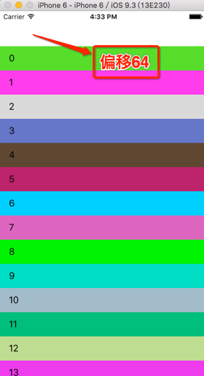

# 例4: contentInset

代码如下：
	//
	//TestTableViewController.m
	//bounds_frame03
	//
	//Created by hui on 17/2/9.
	//Copyright © 2017年 hui. All rights reserved.
	//
	
	#import "TestTableViewController.h"
	
	#define KRGBRandomColor [UIColor colorWithRed:arc4random_uniform(255)/255.0 green:arc4random_uniform(255)/255.0 blue:arc4random_uniform(255)/255.0 alpha:1.0]
	
	@interface TestTableViewController ()
	
	@end
	
	@implementation TestTableViewController
	
	- (void)viewDidLoad {
	[super viewDidLoad];
	
	//会导致tableView向下偏移64
	self.tableView.contentInset = UIEdgeInsetsMake(64, 0, 0, 0);
	}
	
	- (void)didReceiveMemoryWarning {
	[super didReceiveMemoryWarning];
	//Dispose of any resources that can be recreated.
	}
	
	#pragma mark - Table view data source
	- (NSInteger)tableView:(UITableView *)tableView numberOfRowsInSection:(NSInteger)section {
	
	return 30;
	}
	
	- (UITableViewCell *)tableView:(UITableView *)tableView cellForRowAtIndexPath:(NSIndexPath *)indexPath {
	
	static NSString *ID = @"cell";
	UITableViewCell *cell = [tableView dequeueReusableCellWithIdentifier:ID];
	if (!cell) {
	cell = [[UITableViewCell alloc] initWithStyle:UITableViewCellStyleDefault reuseIdentifier:ID];
	
	}
	cell.contentView.backgroundColor = KRGBRandomColor;
	cell.textLabel.text = [NSString stringWithFormat:@"%li",indexPath.row];
	return cell;
	}
	
	- (void)tableView:(UITableView *)tableView didSelectRowAtIndexPath:(NSIndexPath *)indexPath {
	NSLog(@"tablView.bounds -> %@",NSStringFromCGRect(tableView.bounds));
	NSLog(@"tableView.contentOffset -> %@",NSStringFromCGPoint(tableView.contentOffset));
	}
