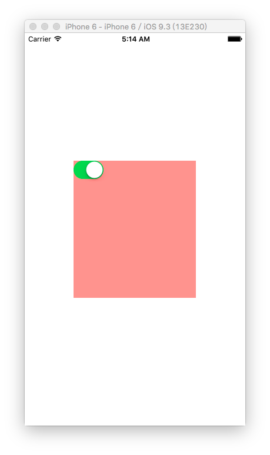
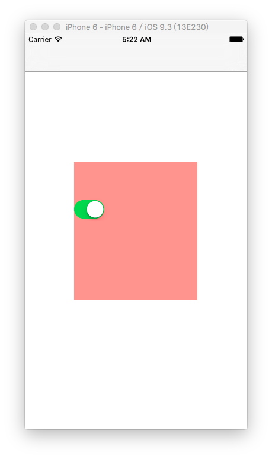

1. 无导航控制器，打印scrollView内边距
 
	
	
	代码如下：

		//
		//  ViewController.m
		//  bounds frame 04
		//
		//  Created by hui on 17/2/10.
		//  Copyright © 2017年 hui. All rights reserved.
		//
		
		#import "ViewController.h"
		
		@interface ViewController ()
		
		@property (weak, nonatomic) IBOutlet UIScrollView *scrollView;
		@end
		
		@implementation ViewController
		
		- (void)viewDidLoad {
		    [super viewDidLoad];
		
		}
		
		- (void)touchesBegan:(NSSet<UITouch *> *)touches withEvent:(UIEvent *)event {
		    
		    NSLog(@"%@",NSStringFromUIEdgeInsets(self.scrollView.contentInset));
		}
		
		@end
	
	打印结果：内边距为0

		2017-02-10 05:12:58.106 bounds frame 04[9389:134037] {0, 0, 0, 0}
		
2. 添加导航控制器后，再打印scrollView内边距

	

	打印结果：向下偏移64

		2017-02-10 05:23:14.116 bounds frame 04[9919:140812] {64, 0, 0, 0}
		
3. 在storyboard中隐藏导航栏
	

	

	打印结果：向下偏移20

		2017-02-10 05:29:39.110 bounds frame 04[10254:146596] {20, 0, 0, 0}
	
4. 当存在多个scrollView时，只会自动调整最先添加的那一个内边距
	
5. 关闭自动调整scrollView内边距的两种办法：

	- 第1种办法：【推荐】

			- (void)viewDidLoad {
			    [super viewDidLoad];
			
			    self.automaticallyAdjustsScrollViewInsets = NO;
			}
		
	

	- 第2种办法：

			- (void)viewDidLoad {
			    [super viewDidLoad];
			
			    self.scrollView.contentInset = UIEdgeInsetsMake(-64, 0, 0, 0);
			}