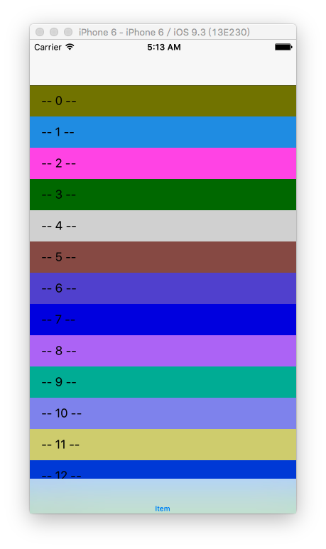
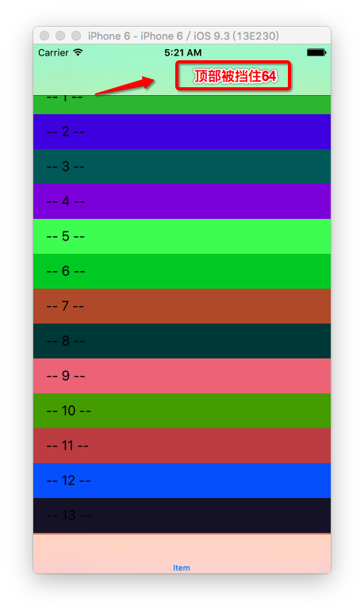
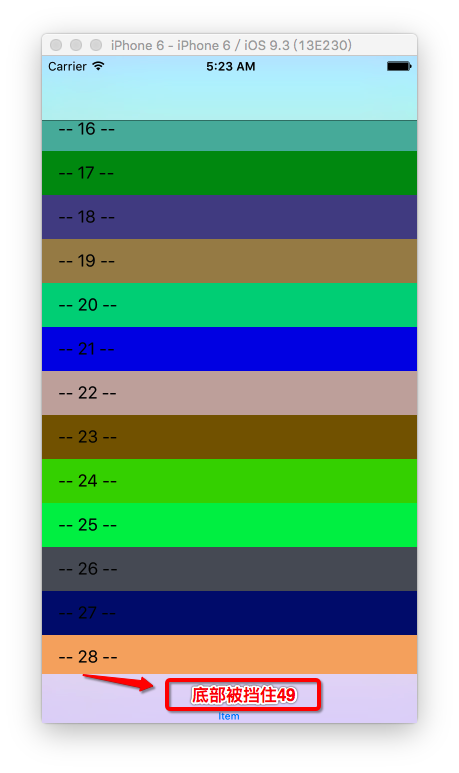
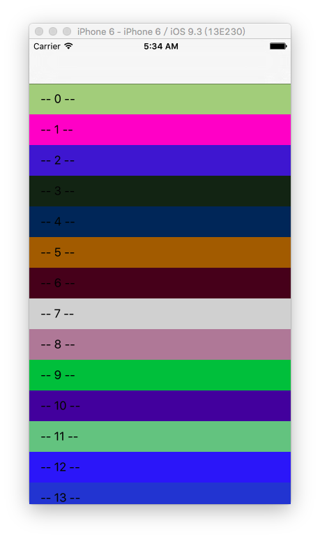
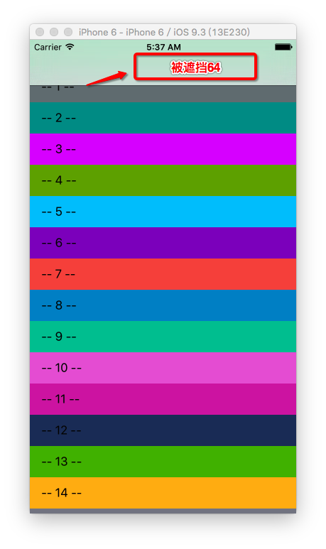
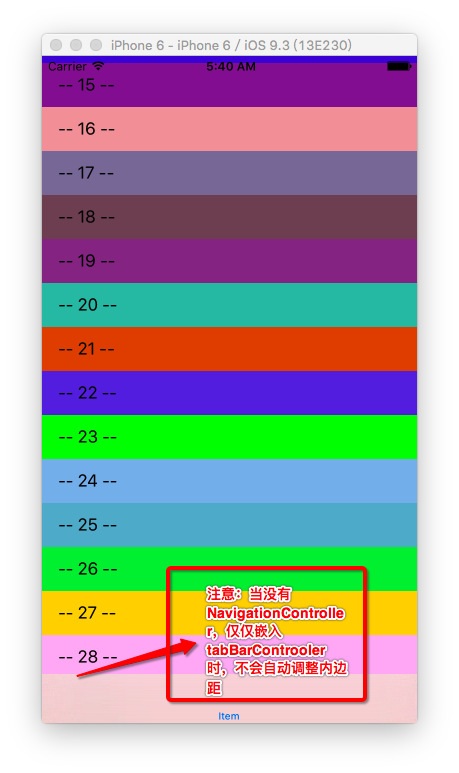
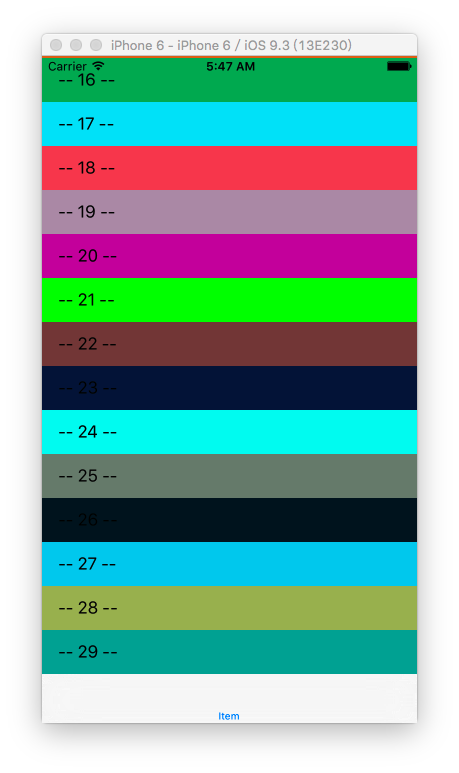

#### 1. 给表UITableViewController，嵌入UINavigationController，再给UINavigationController嵌入UITabBarController

		//
		//  TableViewController.m
		//  bounds frame 05
		//
		//  Created by hui on 17/2/11.
		//  Copyright © 2017年 hui. All rights reserved.
		//
		
		#import "TableViewController.h"
		
		#define KRGBRandomColor [UIColor colorWithRed:arc4random_uniform(255)/255.0 green:arc4random_uniform(255)/255.0 blue:arc4random_uniform(255)/255.0 alpha:1.0]
		
		@interface TableViewController ()
		
		@end
		
		@implementation TableViewController
		
		- (void)viewDidLoad {
		    [super viewDidLoad];
		    
		}
		
		#pragma mark - Table view data source
		
		- (NSInteger)numberOfSectionsInTableView:(UITableView *)tableView {
		#warning Incomplete implementation, return the number of sections
		    return 1;
		}
		
		- (NSInteger)tableView:(UITableView *)tableView numberOfRowsInSection:(NSInteger)section {
		#warning Incomplete implementation, return the number of rows
		    return 30;
		}
		
		- (UITableViewCell *)tableView:(UITableView *)tableView cellForRowAtIndexPath:(NSIndexPath *)indexPath {
		    static NSString *ID = @"cell";
		    UITableViewCell *cell = [tableView dequeueReusableCellWithIdentifier:ID];
		    if (!cell) {
		        cell = [[UITableViewCell alloc] initWithStyle:UITableViewCellStyleDefault reuseIdentifier:ID];
		    }
		    cell.textLabel.text = [NSString stringWithFormat:@"-- %li --",indexPath.row];
		    cell.contentView.backgroundColor = KRGBRandomColor;
		    return cell;
		}
		
		- (void)tableView:(UITableView *)tableView didSelectRowAtIndexPath:(NSIndexPath *)indexPath {
		    
		    NSLog(@"tableView's contentInset is %@",NSStringFromUIEdgeInsets(tableView.contentInset));
		}
	


- 打印内边距：


		2017-02-11 05:09:27.615 bounds frame 05[3593:38706] tableView's contentInset is {64, 0, 49, 0}
	
- 关闭自动调整内边距后，顶部被遮挡64，底部被遮挡49

		- (void)viewDidLoad {
		    [super viewDidLoad];
		    
		    self.automaticallyAdjustsScrollViewInsets = NO;
		}




#### 2. 给UITableViewController仅嵌入UINavigationController


- 打印内边距：

		2017-02-11 05:34:50.911 bounds frame 05[4977:59134] tableView's contentInset is {64, 0, 0, 0}
	
- 关闭自动调整内边距后，顶部被遮挡64

		- (void)viewDidLoad {
		    [super viewDidLoad];
		    
		    self.automaticallyAdjustsScrollViewInsets = NO;
		}



#### 3. 给UITableViewController仅嵌入UITabController


- 注意：当没有UINavigationController，仅仅嵌入UITabBarController时，并不会自动调整内边距，不会往上调整49的高度
- 但是，此时的self.automaticallyAdjustsScrollViewInsets仍然是YES，默认就是YES，也就是说，你这时希望通过```self.automaticallyAdjustsScrollViewInsets = YES; ```来实现自动调整是没用的
- 正确的做法是：

	    self.tableView.contentInset = UIEdgeInsetsMake(0, 0, 49, 0);



