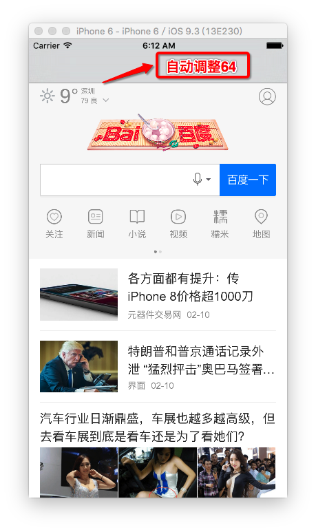
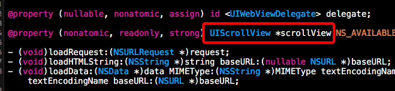
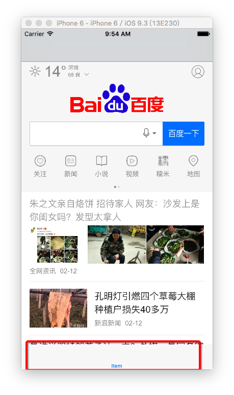
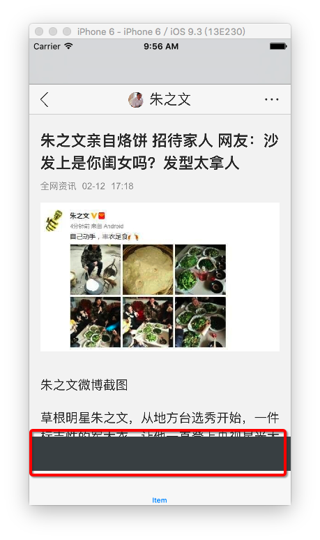
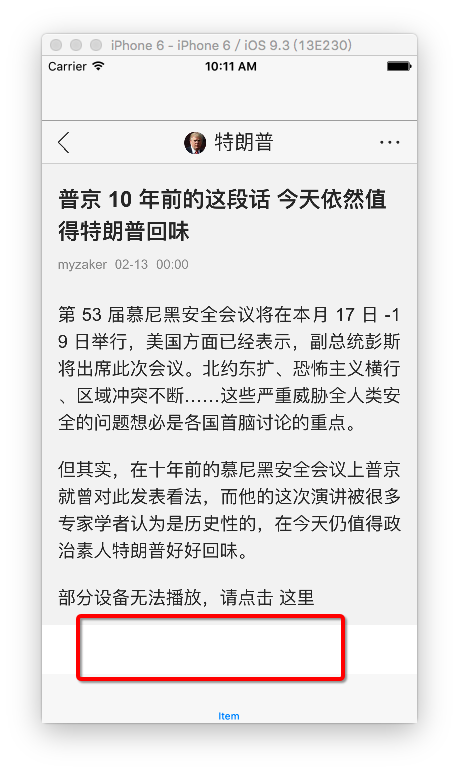

# 1. UIWebView全屏幕

	//
	//  ViewController.m
	//  bounds frame 06
	//
	//  Created by hui on 17/2/11.
	//  Copyright © 2017年 hui. All rights reserved.
	//
	
	#import "ViewController.h"
	
	@interface ViewController ()
	@property (weak, nonatomic) IBOutlet UIWebView *webView;
	
	@end
	
	@implementation ViewController
	
	- (void)viewDidLoad {
	    [super viewDidLoad];
	    
	    // 注意：如果http://www.baidu.com则需要设置允许http请求
	    NSURL *url = [NSURL URLWithString:@"https://www.baidu.com"];
	    NSURLRequest *request = [NSURLRequest requestWithURL:url];
	    [self.webView loadRequest:request];
	}
	
	@end
	
# 2. 为UIWebView嵌入UINavigationController

- 当UIWebView处于导航控制器管理下时，自动调整了内边距，这是因为UIWebView内部存在一个scrollView
- 这也是UIWebView可以实现滚动的原因

# 3. 为UINavigationController再嵌入UITabBarController

- 随便点击进入一个页面，发现底部有黑边

- 解决UIWebView底部黑边的办法：

[网上解决办法](http://www.th7.cn/Program/IOS/201602/768701.shtml)

	_contentWebView.opaque = NO;
	_contentWebView.backgroundColor = [UIColor clearColor]; 
	
- 这种办法虽然解决了黑边，但发现底部有个白边，只是不明显（仅仅将黑边换成了白边吗？？）

